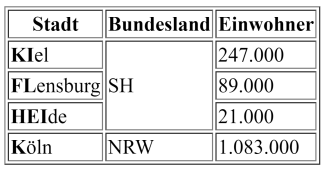

# Aufgabenbereich 1: HTML

## Aufgabe 1.1 - 3 Punkte

Schreibe ein HTML-Fragment ohne Verwendung von CSS, das folgende Liste
erzeugt.

## Aufgabe 1.2 - 4 Punkte

Schreibe ein HTML-Fragment ohne Verwendung von CSS, das folgende Tabelle erzeugt.

## Aufgabe 1.3 - 3 Punkte

Schreibe ein HTML-Fragment inkl. Verwendung von CSS, das die Kindelemente in
einem Flexbox-Container mit der ID "container" horizontal hintereinander und
innerhalb einer Zeile zentriert positioniert (vgl. Abb.).

- Die Kindelemente sollen automatisch in eine neue Zeile umbrechen, falls nicht
ausreichend Raum in der Breite verfügbar ist
- Der äußere Abstand (margin) sowie das linke und rechte Padding je Kindelement
seien 10px.
- Der Flexbox-Container und seine Kindelemente sollen einen einfachen
schwarzen Rand (border) haben.
- Es sollen 5 Kindelemente unterschiedlicher Breite hinzugefügt werden.
