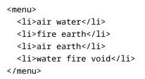
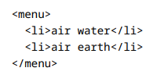

# Aufgabenbereich 3: JavaScript und Document Object Model (DOM)

Beachte bitte bei der folgenden JavaScript-Programmierung, dass dein Code nicht
ausschließlich gegen die dargestellten Beispiele getestet wird. Der Code muss
ausführbar sein. Der Code wird in einer Sandbox ausgeführt, in der asynchrone
Funktionen, WebAssembly und die Methode eval() deaktiviert sind.

## Aufgabe 3.1 - 2 Punkte

Schreibe eine JavaScript-Funktion,<pre> isDivider(a, b) </pre> die prüft, ob eine Zahl b ein
ganzzahliger Teiler einer Zahl a ist.
Beachte, dass die Funktion tatsächlich genau wie angegeben bezeichnet ist. Dies gilt
auch für die folgenden Aufgaben.

## Aufgabe 3.2 - 2 Punkte

Schreibe eine JavaScript-Funktion sumOfDividers(a) , die die Summe der positiven
Teiler einer Zahl a ohne sich selbst als Teiler zurückgibt, z.B. <pre> sumOfDividers(8) = 1 + 2 + 4 = 7 .</pre>
Wenn die Funktion isDivider(a, b) aus der vorherigen Aufgabe wiederverwendet
wird, darf sie im folgenden Eingabefeld nicht erneut definiert werden.

## Aufgabe 3.3 - 2 Punkte

Schreibe eine JavaScript-Funktion <pre> isPerfectNumber(a) </pre> , die prüft, ob eine Zahl a
eine "perfekte Zahl" ist. Dies ist der Fall, wenn die Summe ihrer positiven Teiler ohne
sich selbst gleich der Zahl selbst ist, z.B. isPerfectNumber(6) = true , da
sumOfDividers(6) = 1 + 2 + 3 = 6 .
Wenn die Funktionen aus den vorherigen Aufgaben wiederverwendet werden, dürfen
sie im folgenden Eingabefeld nicht erneut definiert werden.

## Aufgabe 3.4 - 4 Punkte

Schreibe eine JavaScript-Funktion <pre> findPerfectNumbers(n) </pre> , die alle perfekten
Zahlen ≤ n aufsteigend sortiert in einem Array zurückgibt.
Wenn die Funktionen aus den vorherigen Aufgaben wiederverwendet werden, dürfen
sie im folgenden Eingabefeld nicht erneut definiert werden.

## Aufgabe 3.5 - 4 Punkte

Schreibe ausführbaren JavaScript-Code, der ein DOM zu folgendem HTML-Ausschnitt
wie folgt manipuliert: Alle ListItem-Elemente sollen aus einem übergeordneten MenuElement entfernt werden, wenn sie die Zeichenfolge "fire" beinhalten. Auf das DOM
kann über die Variable document zugegriffen werden.

Beispiel vorher:

Beispiel nachher:

## Aufgabe 3.6 - 4 Punkte

Schreibe ausführbaren JavaScript-Code, der ein DOM zu folgendem HTML-Ausschnitt
wie folgt manipuliert: Jedes Kindelement des Elements mit der ID "list" enthält eine
durch Leerzeichen getrennte Liste von Zahlen. Der Inhalt jedes Kindelements soll
durch die Summe der jeweils enthaltenen Zahlen ersetzt werden. Auf das DOM kann
über die Variable document zugegriffen werden.

## Aufgabe 3.7 - 4 Punkte

Schreibe eine JavaScript-Funktion <pre>inhabitantsOfState(objects, state)</pre> , der im
ersten Argument ein Objekt-Array übergeben wird. Jedes Objekt im Array hat die
Eigenschaften city, state und inhabitants. Die Funktion soll die Objekte hinsichtlich der
Eigenschaft state entsprechend dem zweiten Argument filtern und anschließend die
Summe der Eigenschaft inhabitants der verbliebenen Objekte zurückgeben.

<pre>
const objects = [{
        city: "Kiel",
        state: "SH",
        inhabitants: 247000
    },
    {
        city: "Köln",
        state: "NRW",
        inhabitants: 1083000
    },
    {
        city: "Flensburg",
        state: "SH",
        inhabitants: 89000
    },
    {
        city: "Heide",
        state: "SH",
        inhabitants: 21000
    }
]
</pre>
